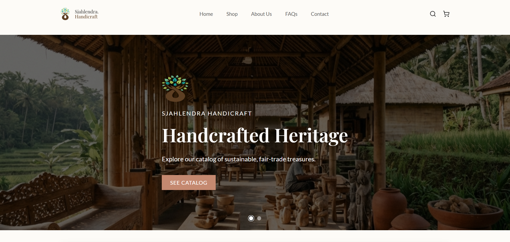
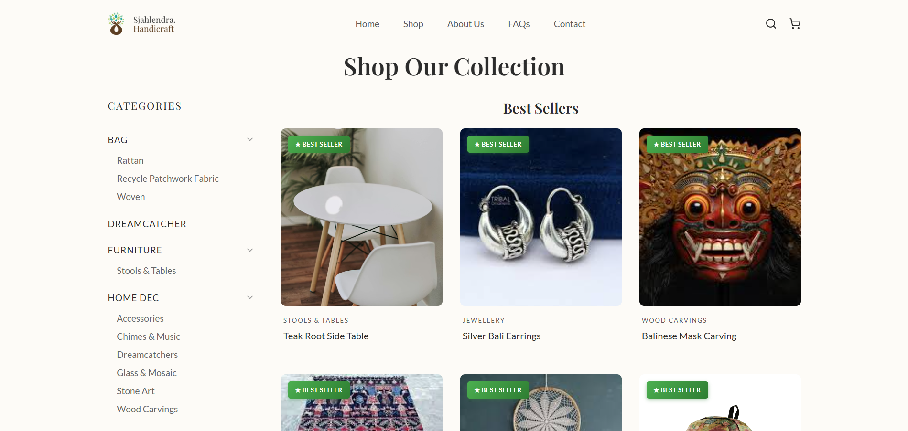
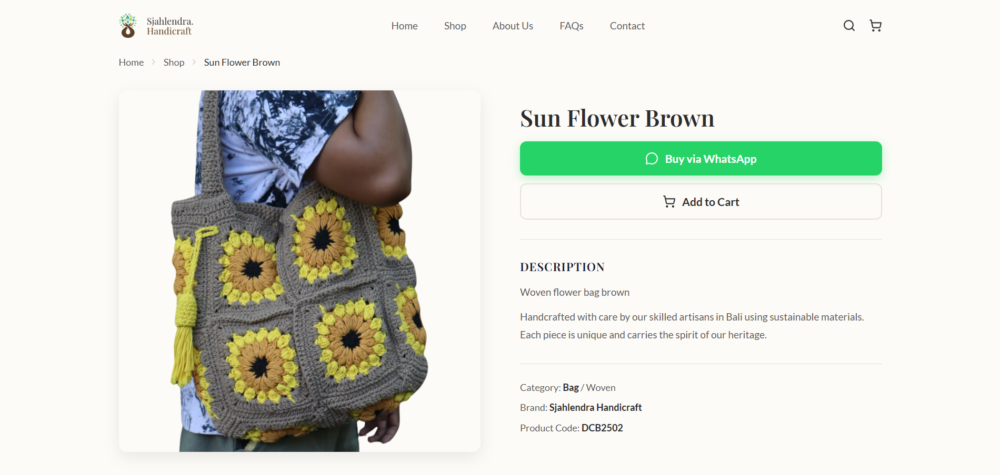

<div align="center">


<h1>Sjahlendra Handicraft</h1>

A production e-commerce website built for a real Balinese artisan business serving live customers with a full storefront and a private content management system.

[](https://sjahlendrahandicraft.com)
[](https://react.dev)
[](https://vitejs.dev)
[](https://supabase.com)
[](https://vercel.com)
[](LICENSE)

</div>

---

## About the Project

Sjahlendra Handicraft is an artisan business based in Bali, Indonesia, that produces handmade furniture, home décor, and fashion items using sustainable materials and traditional Balinese craftsmanship.

This project was built as a **real production website** for the business, replacing their previous static presence with a modern dynamic platform. The platform allows customers to explore products, browse categories, and contact the business directly via WhatsApp while giving the client full control of the content through a private CMS.

The goal was to build a **fast, scalable, and easy-to-manage digital storefront** that supports the business without requiring technical knowledge from the client.

🔗 **Live Website:** https://sjahlendrahandicraft.com

---

## Screenshots

<div align="center">
  
  <br/><br/>
  
  
</div>

---

## Architecture
This project uses a modern **serverless architecture**:

- **Serverless backend** reduces operational overhead no server to manage
- **Supabase PostgreSQL** provides a scalable, managed database
- **Vercel CDN** ensures fast global loading with edge caching
- **React SPA** enables smooth, app like browsing without full page reloads

---

## Pages

| Page | Description |
|------|-------------|
| **Home** | Hero carousel, trending products, category highlights, and brand story |
| **Shop** | Full catalogue with category filters, search, sort, grid/list toggle, and pagination |
| **Product Detail** | Product images, rich text description, and direct WhatsApp inquiry |
| **Cart** | Add/remove items, adjust quantities persisted in localStorage |
| **Wishlist** | Save products for later |
| **About** | Brand story and background, fully editable from the CMS |
| **FAQs** | Accordion-style FAQ, managed by the client |
| **Contact** | Contact form with business info pulled live from the database |
| **Admin (CMS)** | Private dashboard for full content management |

---

## Features

**Storefront**
- Hero carousel with mobile-specific images
- Global search from the navigation bar
- Shop page with search, sort, category filter, and pagination
- Product detail with rich text description
- WhatsApp inquiry integration
- Shopping cart persisted in localStorage
- Wishlist system
- Fully responsive  mobile, tablet, and desktop

**Content Management System**
- Manage product catalogue (add / edit / hide products)
- Manage homepage banners and carousel
- Edit About page and FAQ section
- Update contact information and site settings
- No coding knowledge required for the client

---

## Tech Stack

| Category | Technology |
|----------|------------|
| Frontend | React 19 |
| Build Tool | Vite 7 |
| Routing | React Router DOM v7 |
| Backend & Database | Supabase (PostgreSQL) |
| Authentication | Supabase Auth |
| Storage | Supabase Storage |
| Rich Text Editor | React Quill |
| Icons | Lucide React |
| Styling | Plain CSS with custom properties |
| Deployment | Vercel |
| Analytics | Vercel Analytics + Speed Insights |

---

## Security

- Supabase **Row Level Security (RLS)** on all tables
- Environment variables managed via `.env` never exposed to the client
- **Protected CMS routes** admin dashboard requires authentication
- Sanitized HTML output from the rich text editor
- Secure API communication through the Supabase JS client

---

## Performance

- `<picture>` element for responsive image optimization
- `fetchpriority="high"` on hero images for faster LCP
- Preloaded fallback images to reduce layout shift
- Client side filtering to minimize unnecessary API calls
- Vercel CDN for global asset caching

---

## Project Structure

```
src/
├── components/
│   ├── common/
│   ├── layout/
│   └── sections/
├── context/
├── lib/
├── pages/
│   ├── Home/
│   ├── Shop/
│   ├── ProductDetail/
│   ├── Cart/
│   ├── Wishlist/
│   ├── About/
│   ├── Contact/
│   ├── FAQs/
│   └── Admin/
├── styles/
└── utils/
```

---

## Running Locally

```bash
git clone https://github.com/Krisnarhesa/sjahlendra-handicraft.git
cd sjahlendra-handicraft
npm install
npm run dev
```

Create a `.env` file in the root directory:

```
VITE_SUPABASE_URL=your_supabase_url
VITE_SUPABASE_ANON_KEY=your_supabase_anon_key
```

---

## Deployment

Deployed on Vercel. The `vercel.json` includes a catch-all rewrite to handle client-side routing. Add the two env vars above in your Vercel project settings and it'll work out of the box.

---

## Authors
**bagastyaAdi**

[](https://github.com/bagastyaAdi)

**Krisnarhesa**

[](https://github.com/Krisnarhesa)

---

## License

This project is proprietary software built for a real client  **Sjahlendra Handicraft**.

The source code is shared publicly for portfolio purposes only. Viewing and learning from the code is permitted, but copying, modifying, distributing, or using any part of this codebase commercially or otherwise is strictly prohibited without prior written permission from the authors.

© 2026 Krisnarhesa & bagastyaAdi. All rights reserved.

---

<div align="center">
  <sub>Built with care for a real client. Ethically sourced, sustainably crafted. 🌿</sub>
</div>
